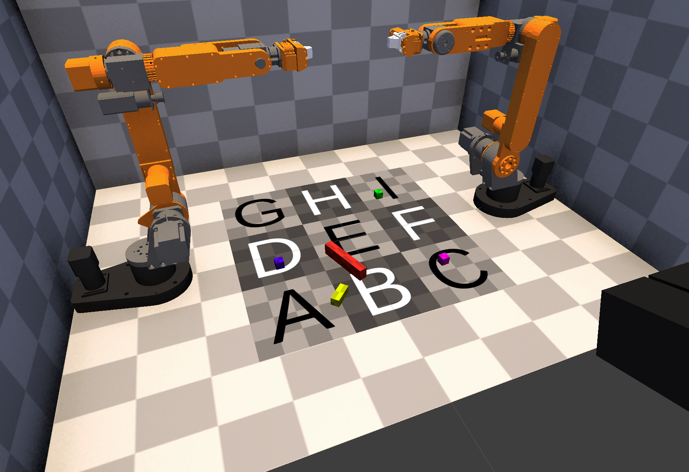
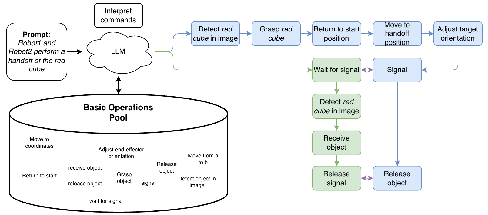
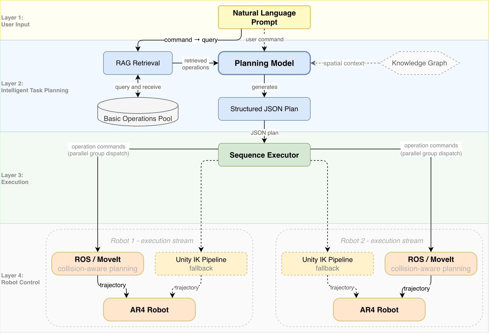
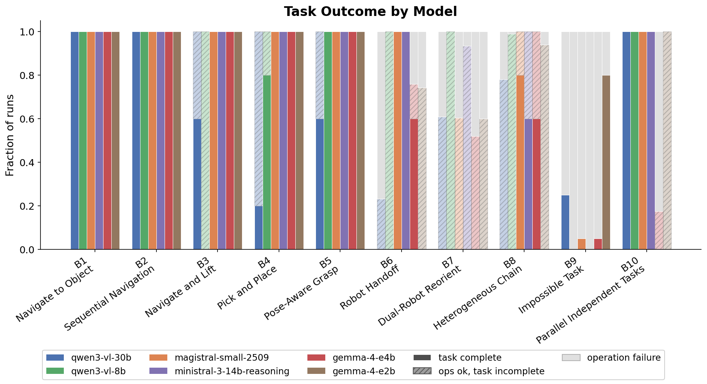
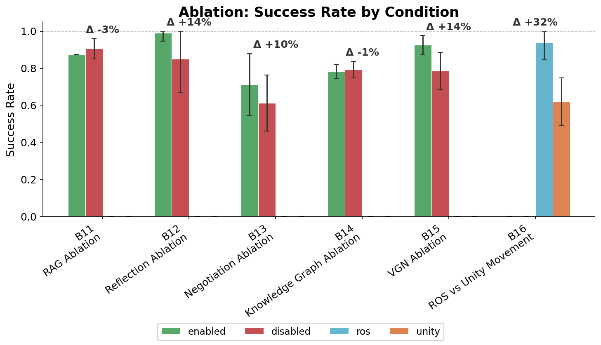
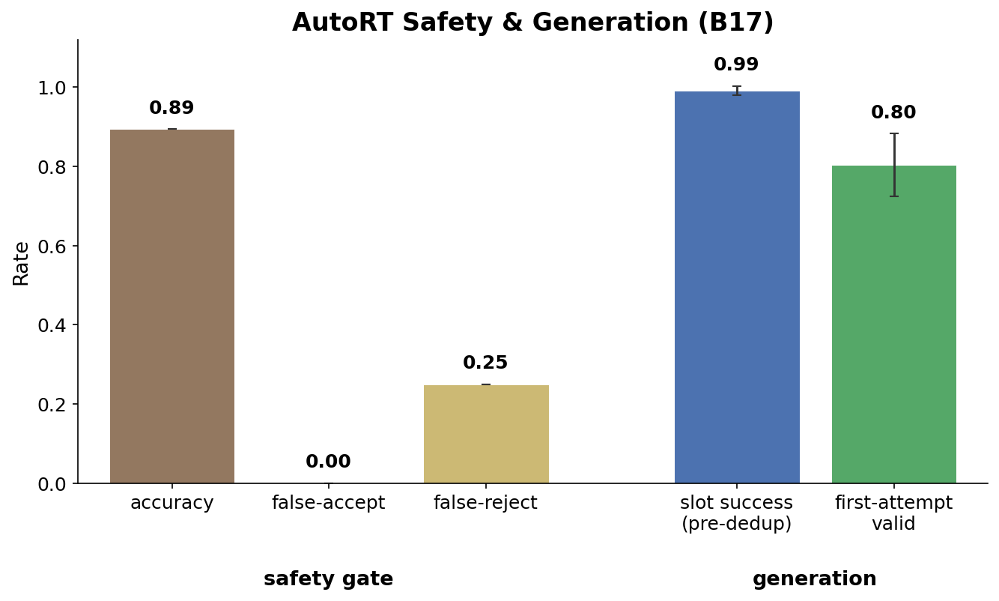

# Building Cooperative Robot Behavior from Basic Action Modules

LLM-driven collaborative control for two AR4 robotic arms. A locally hosted model translates natural-language instructions into coordinated dual-arm behavior by composing a structured pool of 20 robot operations, no task-specific training, no hard-coded sequencing logic, no cloud dependencies. Developed as a master's thesis at Heidelberg University (project codename **ACRL** Auto-Cooperative Robot Learning).

<p align="center">
  
</p>

Given a single prompt like _"Robot1 and Robot2 perform a handoff of the red cube"_, the LLM selects and sequences operations from the pool detection, grasping, signaling, handoff reception, composing the coordination from `signal`/`wait_for_signal` primitives (guided by handoff rules in the prompt):

<p align="center">
  
</p>

## Highlights

- **100% task success** on all single-robot benchmarks (B1-B5, 25 runs) and the dual-robot handoff (B6) with Magistral Small 2509 (24B, 4-bit) - zero hallucinated operations, zero retries; evaluated across 17 benchmarks, all running on a single Apple MacBook Pro (M5 Pro, 64 GB) hosting the simulation, Python backend, and Dockerized ROS 2/MoveIt stack together
- **Sustained reliability**: chains of 20 heterogeneous sub-tasks (85 operations per run) complete without failure across all runs (B8)
- **Reliable parallelism**: guided by a general parallel rule, the planner spots task-level independence and schedules concurrent dual-robot plans (0.75 parallelism ratio, 100% task success) for four of six backends; both Gemma 4 models fail to meet the parallel-scheduling criterion (B10)
- **Quantified ablations**: negotiation +10 pp per-task success for the default model only (roughly neutral for three of the other five backends, negative for two, pooling to a net cost); reflection +14 pp; VGN neural grasp prediction +33 pp grasp reliability (pooled across six models, held-and-lifted-off-the-table scoring, 41.7% → 75.0%) - an execution-path audit attributes the gain to grasp positioning rather than VGN's predicted orientation; ROS/MoveIt shows a +32 pp task-success gap that is a model-independent grasp-execution effect (`grasp_object` timeouts occur only under Unity routing, never under ROS) rather than a perception artifact, and is kept for collision-aware motion planning point-to-point IK cannot represent; RAG helps no backend (Ministral roughly neutral at +2.5 pp), pooling to a net cost (-7.2 pp); knowledge-graph context injection is a small net cost
- **Known limitations**: concurrent bimanual manipulation (B7) remains unsolved - the failure is partner-aware target selection, not plan decomposition: each arm resolves its lift target independently, so two individually valid targets collide against the 0.2 m separation check (and a cross-robot `wait_for_signal` can go undispatched outside an explicit parallel group). Impossible-task rejection (B9) is also unsolved: at 20 runs per model no backend rejects reliably (pooled 0.19), and the one model that does reject consistently appears to do so by failing to parse at all

**Key Features**:

- Unity 6000.3.11f1 simulation with physics-based ArticulationBody robots and damped least-squares IK (6-DOF)
- 20-operation registry in four complexity tiers (Atomic / Basic / Intermediate / Complex) with variable passing between operations
- RAG-augmented command parsing: semantic retrieval narrows the LLM context to relevant operations
- Reflection-style failure recovery: structured error feedback drives corrective re-planning
- Optional multi-agent negotiation protocol for role-ambiguous dual-robot tasks
- ROS 2 / MoveIt collision-aware motion planning (Docker, planning-only - Unity executes)
- Stereo vision + YOLO object detection; optional VGN neural grasp-pose prediction (runs on Apple Silicon)
- AutoRT-style autonomous task generation with two-layer safety (semantic LLM + kinematic code checks)
- Optional NetworkX knowledge graph for spatial reasoning
- Sim2real hardware abstraction: `--env sim|real` switches camera/robot adapters, no code changes
- Mission Control web dashboard (FastAPI) with benchmark analytics

## Getting Started

### Prerequisites

- **Unity Hub** with Unity Editor **6000.3.11f1** (exact version required)
- **Python 3.12** with virtual environment support
- **Docker** (for the ROS 2 / MoveIt stack - ROS is enabled by default; skip with `--without-ros`)
- **LM Studio** serving:
  - `mistralai/magistral-small-2509` (planning/reasoning model)
  - `text-embedding-nomic-embed-text-v1.5` (RAG embeddings)
  - OpenAI-compatible endpoint at `http://127.0.0.1:1234/v1` (default)
- **Git** with submodule support

### Dependencies

**Unity packages** (via Package Manager): NuGetForUnity (for MathNet.Numerics), Unity Input System, Universal Render Pipeline, Unity Test Framework.

**Python**: everything is pinned in `ACRLPython/requirements.txt` (numpy, opencv-python, torch, ultralytics, open3d, fastapi, pytest, …). Optional extra: `pip install networkx` if you enable the knowledge graph (`KNOWLEDGE_GRAPH_ENABLED=true`).

### Installing

1. **Clone the repository with submodules**:

   ```bash
   git clone --recursive https://github.com/JanMStraub/Cooperative-Robot-Behavior-from-Basic-Action-Modules.git
   cd Cooperative-Robot-Behavior-from-Basic-Action-Modules
   ```

2. **Setup Python environment**:

   ```bash
   cd ACRLPython
   python -m venv acrl
   source acrl/bin/activate  # On Windows: acrl\Scripts\activate
   pip install -r requirements.txt
   ```

3. **Open Unity project**:
   - Open Unity Hub, add project from `ACRLUnity/.`
   - Ensure Unity version **6000.3.11f1** is installed
   - Open the project (dependencies auto-install)

4. **Install NuGet packages** (if not auto-installed):
   - In Unity: NuGet > Manage NuGet Packages > install `MathNet.Numerics` (required for IK)

### Running the System

1. **Install and/or load LM Studio model**:
    - Open LM Studio and download a VLM
    - Go to the `Developer` tab and load the model
    - Important: Activate the LM Studio local server in the top left
    - Copy the model name and and change it here: `ACRLPython/config/Servers.py` in line 93

2. **Start Docker**

3. **Start the unified Python backend**:

   ```bash
   cd ACRLPython
   ./start_servers.sh              # or: --without-ros | --env real | --web 8000
   ```

   This starts all servers: ImageServer (5006), CommandServer (5007), SequenceServer (5008), WorldStateServer (5009), AutoRTServer (5010), and optionally WebUIServer (8000).
   The first time the Docker container is getting build, so it takes a bit longer.

4. **Run the Unity simulation**:
   - Open `ACRLUnity/Assets/Scenes/1xAR4Scene.unity` and press Play (the standalone build starts automatically)
   - Send natural-language commands via the Web UI:

### Autonomous Task Generation (AutoRT)

1. With the backend running, add an `AutoRTManager` GameObject to the scene and assign the `AutoRTConfig` asset from `Assets/Configuration/` or use the button in the Web UI
2. Use the custom inspector: **Generate Tasks** → review proposals → **Execute** or **Reject**
3. Optional: enable **Start Loop** for continuous autonomous operation, or run headless:

   ```bash
   python -m orchestrators.RunAutoRT               # human-in-loop ON
   python -m orchestrators.RunAutoRT --autonomous  # no approval gate
   ```

### Testing

- **Unity**: Window > General > Test Runner (PlayMode / EditMode)
- **Python**: First start the system

```bash
   cd ACRLPython/tests
   ./run_tests
```

## Architecture

<p align="center">
  
</p>

A natural-language prompt flows through four layers: (1) command input, (2) RAG retrieval + LLM plan generation, (3) sequence execution with signal/wait synchronization and parallel-group dispatch, (4) physical execution on the two arms via Unity IK or ROS/MoveIt.

**Core Unity components**:

- **SimulationManager / RobotManager**: simulation state and robot lifecycle (singletons)
- **Robot control stack**: TrajectoryController (trapezoidal profiles) → IKSolver (damped least-squares with velocity feedback) → RobotController (ArticulationBody physics)
- **Grasp pipeline**: candidate generation (top/front/side) → IK filter → collision filter → scorer; grasp verification via GripperContactSensor (contact duration + force thresholds)
- **Safety**: ProximityGuard runtime freeze (0.25 m), Python-side static pre-checks, workspace region allocation

**Python backend**:

- **Unified entry point**: `RunRobotController` orchestrates all servers (ports 5006-5010, optional 8000)
- **CommandParser + SequenceExecutor**: LLM/regex hybrid parsing, step-wise dispatch, variable passing (`detect → $target`, then `move to $target`), reflection retries on eligible failures
- **RAG system**: LM Studio embeddings + cosine-similarity vector store; indexes 20 operations, 7 workflow patterns, and 4 multi-robot context documents
- **Operations registry** (20 ops in four tiers):
  - **Atomic** (8): `control_gripper`, `release_object`, `check_robot_status`, `signal`, `wait_for_signal`, `wait`, `reset_simulation`, `yield_workspace`
  - **Basic** (6): `move_to_coordinate`, `adjust_end_effector_orientation`, `return_to_start_position`, `generate_point_cloud`, `detect_field`, `detect_all_fields`
  - **Intermediate** (4): `place_object`, `place_between_objects`, `detect_object_stereo`, `analyze_scene`
  - **Complex** (2): `grasp_object`, `receive_handoff`
- **ROS 2 / MoveIt**: planning-only backend - MoveIt computes joint trajectories, Unity executes them. Three control modes (Unity / ROS / Hybrid, default Hybrid). `ROSMotionClient` handles Unity↔ROS coordinate transforms and talks to the Dockerized `ROSBridge`
- **Multi-robot negotiation** (optional, `NEGOTIATION_ENABLED=true`): per-robot LLM agents run Analysis → round-robin Proposal → Evaluation for up to 3 rounds before execution; falls back to single-LLM parsing
- **AutoRT**: scene perception → LLM task generation → two-layer safety filter (semantic + kinematic) → strategy-based selection → execution

### Key Directories

```
Cooperative-Robot-Behavior-from-Basic-Action-Modules/
├── ACRLDashboard/                       # Web UI source (served by WebUIServer on port 8000)
├── ACRLRosUnityIntegration/             # Docker-based ROS 2 + MoveIt + ros_tcp_endpoint
├── ACRLThesis/images/                       # Thesis and benchmark figures
├── ACRLUnity/                           # Unity project
│   └── Assets/
│       ├── Configuration/               # ScriptableObject .assets (robot, IK, grasp, gripper, …)
│       ├── Scenes/                      # 1xAR4Scene
│       ├── Scripts/
│       │   ├── ConfigScripts/           # ScriptableObject definitions
│       │   ├── PythonCommunication/     # TCP clients and protocol
│       │   ├── RobotScripts/            # Robot control, IK, grasp pipeline, gripper, ROS components
│       │   └── SimulationScripts/       # SimulationManager, WorkspaceManager
│       └── Prefabs/                     # Robot and environment prefabs
└── ACRLPython/                          # Python backend
    ├── core/                            # TCPServerBase, UnityProtocol, lazy imports, logging
    ├── camera/                          # Sim2real camera abstraction (Unity | USB/RealSense)
    ├── hardware/                        # Sim2real robot abstraction (Unity | ROS/MoveIt)
    ├── servers/                         # ImageServer, CommandServer, SequenceServer,
    │                                    # WorldStateServer, AutoRTServer, WebUIServer,
    │                                    # NegotiationHub (not a TCP server)
    ├── operations/                      # 20 registered operations + registry
    │   └── grasp/                       # Grasp implementation (_dispatcher, _handoff, _ros, _vgn)
    ├── grasp_planning/                  # Python-side grasp pipeline (ROS/MoveIt path)
    ├── orchestrators/                   # RunRobotController (entry), CommandParser, SequenceExecutor
    ├── rag/                             # Embeddings, vector store, indexer, query engine
    ├── agents/                          # Per-robot negotiation agents
    ├── autort/                          # Task generation loop, selector, Robot Constitution
    ├── benchmark_results/               # Benchmark run JSONs (b1-b17)
    ├── knowledge_graph/                 # Optional NetworkX spatial reasoning
    ├── ros2/                            # ROSMotionClient, ROSBridge
    ├── vision/                          # YOLO detection, stereo depth (SGBM)
    ├── benchmarks/                      # Benchmark framework (Run.py, cases/B1-B17)
    ├── config/                          # All configuration modules (env-var overridable)
    ├── tools/                           # CLI utilities incl. PlotBenchmarks
    └── tests/                           # Test suite (~100 files)
```

## Configuration

- **Robot/IK/grasp tuning** (Unity): `ACRLUnity/Assets/Configuration/*.asset` - `RobotProfile` (sim joint stiffness/damping/limits), `RealRobotProfile` (hardware compliance model), `IKConfig`, `GraspConfig`, `GripperConfig`, `TrajectoryConfig`
- **Simulation**: `Simulation.asset` (time scale, auto-start, reset behavior)
- **AutoRT**: `AutoRTConfig.asset` (Unity-side UI/loop) and `ACRLPython/config/AutoRT.py` (LLM settings, safety bounds, selection strategy)
- **Python backend**: `ACRLPython/config/` - most parameters accept an environment-variable override of the same name (ports, LLM model/timeouts, RAG thresholds, negotiation, knowledge graph). Exception: `config/ROS.py` is code constants only

## Benchmarks & Results

```bash
cd ACRLPython
source acrl/bin/activate    # servers must be running for --live

python -m benchmarks.Run --all --live      # full suite against the simulation
python -m benchmarks.Run --benchmark 3     # single benchmark (1-17)
python -m benchmarks.Run --all --dry-run   # no simulation required
```

Per-run JSON results are written to `ACRLPython/benchmark_results/bN/<model>/`, organized by model for all of B1-B17. B17 runs fully offline (no Unity or server stack required). Aggregate plots: `python -m tools.PlotBenchmarks`.

<p align="center">
  
</p>

<p align="center">
  
</p>

<p align="center">
  
</p>

**System benchmarks** (5 runs each, six LLM backends; B9 at 20 runs):

- **B1**: Navigate to object (detect + move, no grasp)
- **B2**: Sequential multi-target navigation
- **B3**: Navigate, grasp, and lift
- **B4**: Pick and place
- **B5**: Pose-aware grasp (oriented top-down)
- **B6**: Robot handoff (one robot hands object to the other)
- **B7**: Dual-robot reorient with sync barriers
- **B8**: Heterogeneous chain (5 cycles × 4 phases: 3 pick-and-place + 1 parallel scene survey; 20 sub-tasks, 85 operations per run)
- **B9**: Impossible task (parse-only; tests whether the planner rejects an unsatisfiable request instead of hallucinating a plan - at 20 runs per model, no backend does so reliably; pooled rejection rate 0.19)
- **B10**: Parallel independent tasks (dual-robot concurrent pick-and-place)

**Ablations** (single feature flag toggled, all else constant):

- **B11**: RAG (helps no backend; roughly neutral for Ministral +2.5 pp, Magistral, and Qwen3-VL-30B; harms Qwen3-VL-8B and both Gemma 4; pools to -7.2 pp net cost) · **B12**: Reflection (+14 pp task SR) · **B13**: Negotiation (+10 pp task SR for the default model only; roughly neutral for three of the other five backends, negative for two, ~-6 pp pooled) · **B14**: Knowledge Graph (parse-only; small consistent cost) · **B15**: VGN (+33 pp grasp reliability pooled, held-and-lifted scoring) · **B16**: ROS/MoveIt vs. Unity IK (+32 pp task-success gap from `grasp_object` timeouts under Unity routing only - a model-independent grasp-execution effect; ROS also kept for collision-aware planning)

**Autonomous task generation** (offline, drives AutoRT directly, not the command parser):

- **B17**: AutoRT safety gate + generation quality. The two-layer Robot Constitution scores accept/reject verdicts against a hand-labeled task set: accuracy 0.895, false-accept rate 0.0 (never admits an unsafe task), false-reject rate 0.25; the kinematic code check is exact, residual miscalibration sits in the semantic LLM layer. Slot-level generation success 0.99, first-attempt validity 0.80.

## License

This project is licensed under the MIT License.

## Acknowledgments

- [AR4 Robot](https://github.com/zebleck/AR4) - Robot model and gripper controller inspiration
- [MathNet.Numerics](https://numerics.mathdotnet.com/) - Linear algebra for IK computation
- Unity Technologies - ArticulationBody physics system

## Citation

If you use this work in your research, please cite:

```bibtex
@mastersthesis{straub2026acrl,
  author = {Jan M. Straub},
  title = {Building Cooperative Robot Behavior from Basic Action Modules},
  school = {Heidelberg University},
  year = {2026}
}
```

## Contact

For questions or collaboration:

- GitHub: [@JanMStraub](https://github.com/JanMStraub)
- Repository: [Cooperative-Robot-Behavior-from-Basic-Action-Modules](https://github.com/JanMStraub/Cooperative-Robot-Behavior-from-Basic-Action-Modules)
